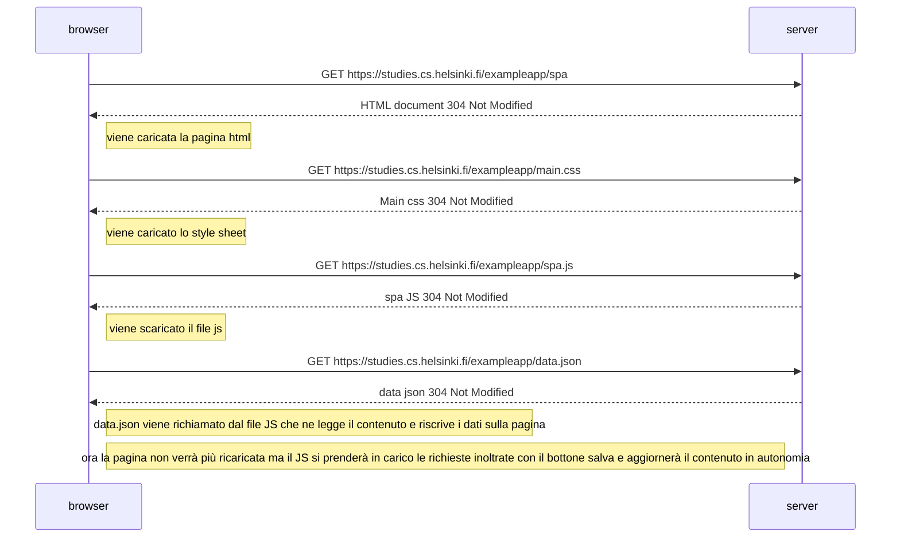

```mermaid
sequenceDiagram
    participant browser
    participant server

    browser->>server: GET https://studies.cs.helsinki.fi/exampleapp/spa
    server-->>browser: HTML document 304 Not Modified
    Note right of browser: viene caricata la pagina html

    browser->>server: GET https://studies.cs.helsinki.fi/exampleapp/main.css
    server-->>browser: Main css 304 Not Modified
    Note right of browser: viene caricato lo style sheet

    browser->>server: GET https://studies.cs.helsinki.fi/exampleapp/spa.js
    server-->>browser: spa JS 304 Not Modified 
    Note right of browser: viene scaricato il file js

    browser->>server: GET https://studies.cs.helsinki.fi/exampleapp/data.json
    server-->>browser: data json 304 Not Modified 
    Note right of browser: data.json viene richiamato dal file JS che ne legge il contenuto e riscrive i dati sulla pagina


    Note right of browser: ora la pagina non verrà più ricaricata ma il JS si prenderà in carico le richieste inoltrate con il bottone salva e aggiornerà il contenuto in autonomia
```