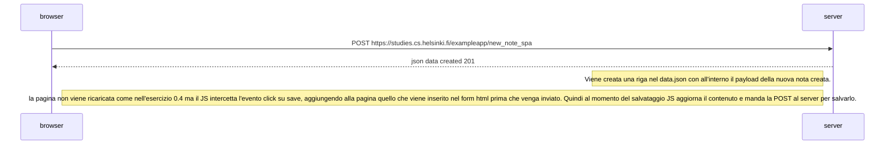

```mermaid
sequenceDiagram
    participant browser
    participant server

    browser->>server: POST https://studies.cs.helsinki.fi/exampleapp/new_note_spa
    server-->>browser: json data created 201
    Note left of server: Viene creata una riga nel data.json con all'interno il payload della nuova nota creata.

    Note right of browser: la pagina non viene ricaricata come nell'esercizio 0.4 ma il JS intercetta l'evento click su save, aggiungendo alla pagina quello che viene inserito nel form html prima che venga inviato. Quindi al momento del salvataggio JS aggiorna il contenuto e manda la POST al server per salvarlo.
```